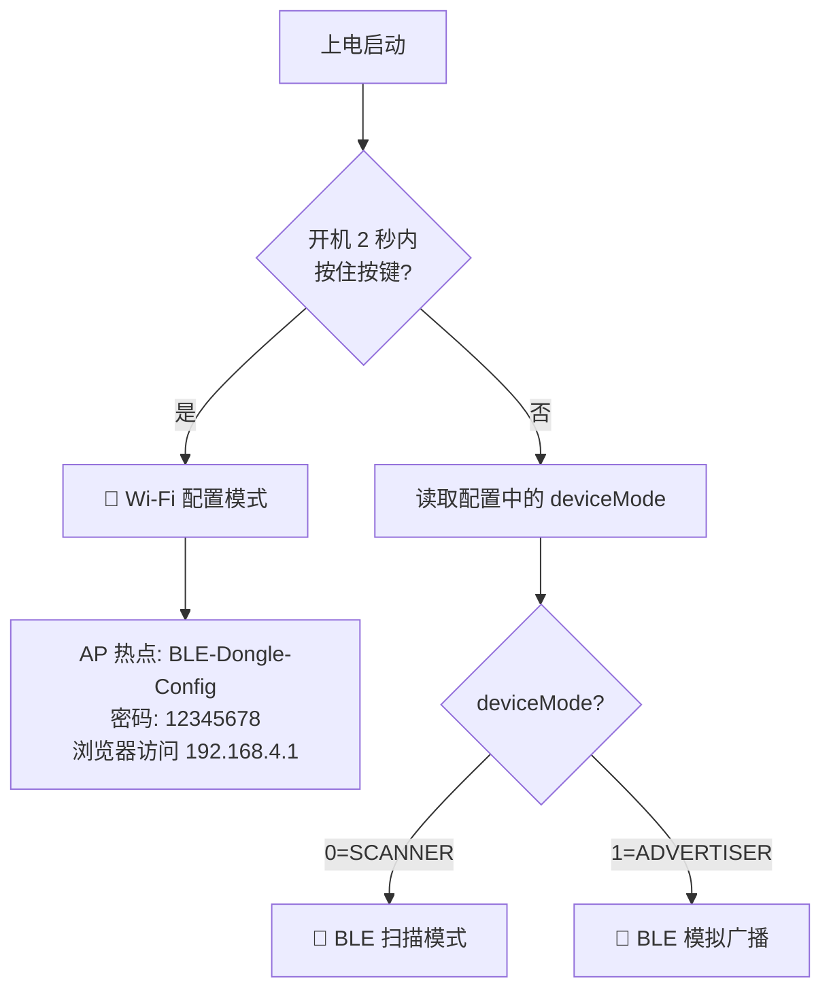
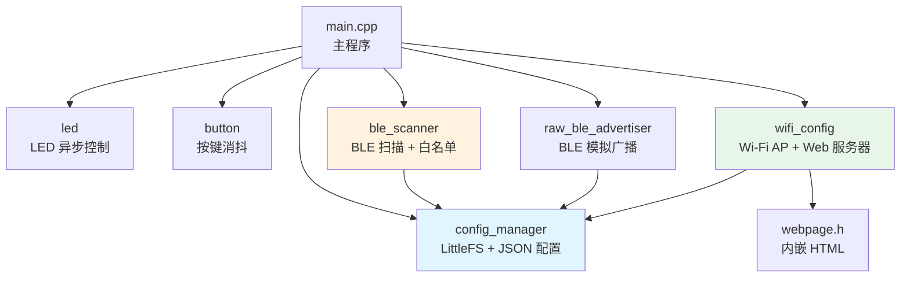
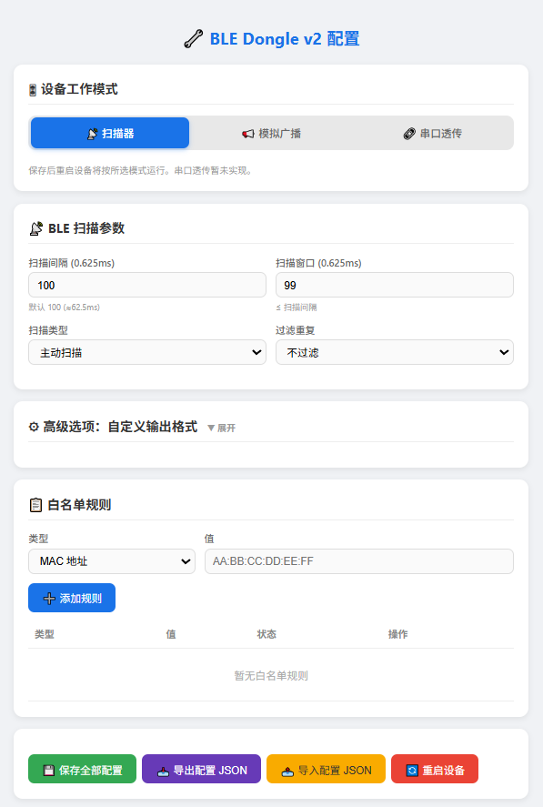
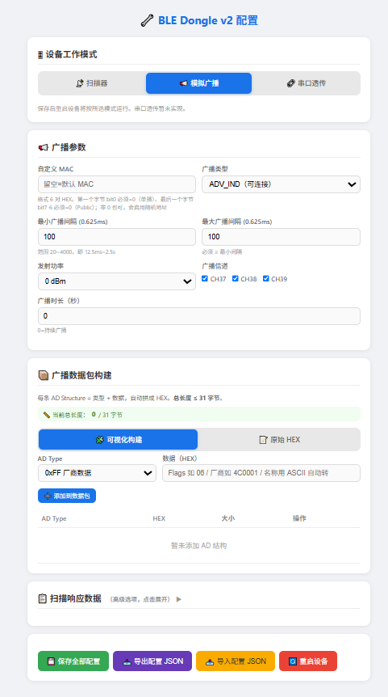

# 🔧 ESP32-C3 BLE Dongle

> 基于 ESP32-C3 的多功能 BLE 扫描/广播设备，支持 Web 配置、自定义输出格式、白名单过滤。

[](https://platformio.org/)
[](https://www.espressif.com/)
[](https://www.arduino.cc/)
[](LICENSE)

---

## 📖 简介

**esp32c3-Dongle** 是一款插上 USB 即可运行的 BLE 工具设备，具备两大核心能力：

| 模式 | 功能 |
|------|------|
| 📡 **BLE 扫描器** | 持续扫描周围 BLE 设备广播，按白名单过滤，通过 USB-CDC 串口输出格式化数据 |
| 📢 **BLE 模拟广播** | 按用户配置构建自定义广播包并持续发送，支持可视化 AD 数据包构建 |

通过 **Wi-Fi 热点 + Web 配置页面** 实现免驱配置，无需安装任何上位机软件。

---

## 🎬 快速开始

### 1. 硬件连接

将 ESP32-C3 通过 USB 插入电脑，设备将通过 USB-CDC 虚拟串口被识别。

### 2. 开机与模式选择



### 3. 配置设备

1. 开机时按住按键 → 进入 Wi-Fi 配置模式
2. 手机/电脑连接热点 `BLE-Dongle-Config`（密码 `12345678`）
3. 浏览器访问 `http://192.168.4.1`（或任意网址，Captive Portal 自动跳转）
4. 在 Web 页面中配置参数并保存

### 4. 查看扫描结果

BLE 扫描模式下，设备通过 USB-CDC 串口（波特率 115200,其实任意波特率都可以，毕竟是CDC虚拟串口）输出格式化数据：

```
$SCAN_START|DURATION:5
$BLE|MAC:AA:BB:CC:DD:EE:FF|RSSI:-42|ADDR:1|NAME:MyDevice|MANUF:4C0012|UUID:...
$BLE|MAC:11:22:33:44:55:66|RSSI:-68|ADDR:0|NAME:OtherDev|MANUF:0059...
$SCAN_END|TOTAL:18|MATCHED:3
```

---

## 🧱 系统架构



### 核心设计原则

- **⚡ 任务隔离**：BLE 回调运行在 BTC_TASK，通过**无锁环形队列**将数据传递到 main loop 输出，避免 UART 互斥锁死锁
- **📦 零堆分配**：BLE 回调中全部使用栈内存（`snprintf` + 固定 buffer），禁止 `String`/`JsonDocument` 堆分配
- **🔄 非阻塞扫描**：使用 `BLEScan::start(duration, callback, false)` 非阻塞模式，扫描完成后自动回调重启

---

## 🌐 Web 配置页面





### 功能一览

| 功能区域 | 说明 |
|---------|------|
| 🎛 设备工作模式 | 扫描器 / 模拟广播 / 串口透传（预留） |
| 📡 BLE 扫描参数 | 间隔、窗口、类型、重复过滤 |
| ⚙ 高级选项 | **自定义输出格式**（占位符体系） |
| 📋 白名单规则 | MAC 地址 / 广播名称 / 厂商 ID |
| 📢 广播参数 | MAC、间隔、功率、信道 |
| 📦 广播数据包构建 | 可视化 AD Structure 构建(支持拖拽排序) + 原始 HEX 模式 |
| 📥/📤 配置导入导出 | JSON 文件备份与恢复 |

### 自定义输出格式

用户可通过**占位符**自由定义串口输出格式：

| 占位符 | 含义 | 适用范围 |
|--------|------|---------|
| `<duration>` | 扫描持续时间(秒) | 扫描开始 |
| `<mac>` | 设备 MAC 地址 | 扫描结果 |
| `<rssi>` | 信号强度 | 扫描结果 |
| `<addr>` | 地址类型 (0=Public, 1=Random) | 扫描结果 |
| `<name>` | 广播名称 | 扫描结果 |
| `<manuf>` | 厂商数据 HEX | 扫描结果 |
| `<uuid>` | Service UUID | 扫描结果 |
| `<total>` | 本轮总包数 | 扫描结束 |
| `<matched>` | 匹配白名单数 | 扫描结束 |

> 📝 **示例**：只需 RSSI 和 MAC → 输入 `<rssi>|<mac>`，输出 `-42|AA:BB:CC:DD:EE:FF`


---

## 📂 项目结构

```
esp32c3-Dongle/
├── platformio.ini             # PlatformIO 项目配置
├── src/                       # 源代码
│   ├── main.cpp               # 主程序入口、模式切换
│   ├── led.h/cpp              # LED 异步控制（ON/OFF/BLINK）
│   ├── button.h/cpp           # 按键消抖（短按/长按检测）
│   ├── config_manager.h/cpp   # 配置管理（LittleFS + JSON）
│   ├── ble_scanner.h/cpp      # BLE 扫描器 + 白名单过滤 + 自定义格式
│   ├── raw_ble_advertiser.h/cpp # BLE 模拟广播器
│   ├── wifi_config.h/cpp      # Wi-Fi AP + Web 服务器 + Captive Portal
│   └── webpage.h              # 内嵌 Web 页面（编译期自动生成）
├── tools/                     # 开发工具
│   ├── web_config.html        # Web 配置页面源文件
│   ├── embed_html.py          # 编译期 HTML→C 头文件嵌入脚本
│   ├── pre_build.py           # 编译前钩子
│   ├── serial_monitor.py      # Python 串口监视器
│   ├── analyze_crash.py       # 崩溃日志分析
│   └── test_stability.ps1     # 稳定性测试
└── doc/                       # 项目文档
    ├── 架构文档.md            # 详细架构文档
    ├── BLE_MAC地址规范.md      # BLE MAC 地址规范
    └── BLE广播知识手册.md      # BLE 广播基础知识
```

---

## 🔌 硬件引脚

| 外设 | 引脚 | 说明 |
|------|------|------|
| LED1 (状态灯) | GPIO12 | 高电平点亮 |
| LED2 (数据灯) | GPIO13 | 高电平点亮 |
| 按键 | GPIO9 | 低电平有效，内部上拉 |
| USB-CDC | — | 虚拟串口，115200 bps |

---

## 🛠 构建与烧录

### 环境要求

- [PlatformIO IDE](https://platformio.org/install) (VS Code 插件) 或 PlatformIO CLI
- ESP32-C3 开发板（本项目使用 AirM2M CORE ESP32C3作为测试，其实任意一个esp32C3的板子都可以）

### 编译

```bash
git clone https://github.com/your-username/esp32c3-Dongle.git
cd esp32c3-Dongle
pio run
```

### 烧录

```bash
pio run --target upload
```

### 串口监视

```bash
pio device monitor -b 115200
```

或使用项目自带的 Python 监视器（带 RSSI 颜色标记）：

```bash
python tools/serial_monitor.py
```

---

## 📊 技术栈

| 类别 | 技术 |
|------|------|
| MCU | ESP32-C3 (RISC-V 160MHz) |
| Flash/RAM | 4MB / 320KB |
| 框架 | Arduino (PlatformIO) |
| BLE 协议栈 | Bluedroid |
| Wi-Fi | ESP32 WiFi + WebServer |
| 文件系统 | LittleFS |
| JSON 库 | ArduinoJson 7.x |
| Web 前端 | 纯 HTML/CSS/JS（内嵌） |
| 开发语言 | C++11 (固件), Python (工具), PowerShell (测试) |

---

## 📈 Flash 分区

| 分区 | 大小 | 用途 |
|------|------|------|
| app0 (固件) | 3 MB | 应用代码 |
| spiffs (文件系统) | 896 KB | LittleFS 配置文件 |
| nvs | 20 KB | 系统 NVS |
| coredump | 64 KB | 崩溃转储 |

当前固件约 1.5 MB，余量约 1.5 MB。

---

## 📚 更多文档

- [架构文档](doc/架构文档.md) — 完整的模块设计、类接口、数据流说明
- [BLE MAC 地址规范](doc/BLE_MAC地址规范.md) — BLE 地址类型与格式规范
- [BLE 广播知识手册](doc/BLE广播知识手册.md) — BLE 广播基础知识

---

## 📄 License

MIT License © 2024
