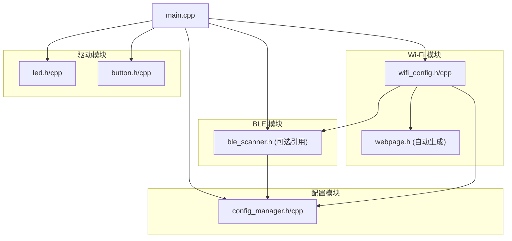

# BLE Dongle — ESP32-C3 项目架构文档

## 1. 项目概述

这是一个基于 **ESP32-C3** 微控制器的 BLE 扫描转发设备（BLE Dongle）项目，使用 **PlatformIO + Arduino 框架**开发。

### 1.1 核心功能

- **BLE 广播扫描**：持续扫描周围 BLE 设备的广播包
- **白名单过滤**：支持按 MAC 地址、设备名称、厂商 ID 三种规则过滤
- **Wi-Fi 热点配置**：开机按按键进入 AP 模式，通过 Web 页面管理白名单
- **USB-CDC 串口输出**：扫描结果通过虚拟串口以自定义格式输出到上位机

### 1.2 硬件信息

| 外设 | 引脚 | 说明 |
|------|------|------|
| LED1 (状态灯) | GPIO12 | 高电平点亮，指示设备状态 |
| LED2 (蓝牙串口数据传输指示灯) | GPIO13 | 高电平点亮，预留 |
| 按键 | GPIO9 | 低电平有效（按下为低），带内部上拉 |
| USB-CDC | — | 虚拟串口，波特率 115200 |

---

## 2. 目录结构

```
BLEDongle/
├── platformio.ini            # PlatformIO 项目配置
├── include/                  # 公共头文件目录（当前未使用）
├── lib/                      # 私有库目录（当前未使用）
├── data/                     # SPIFFS/LittleFS 文件系统数据（当前为空）
├── src/                      # 核心源代码
│   ├── main.cpp              # 主程序入口
│   ├── led.h / led.cpp       # LED 异步控制模块
│   ├── button.h / button.cpp # 按键消抖处理模块
│   ├── config_manager.h/cpp  # 配置管理（LittleFS + JSON）
│   ├── ble_scanner.h/cpp     # BLE 扫描与白名单过滤
│   ├── wifi_config.h/cpp     # Wi-Fi AP + Web 配置服务器
│   └── webpage.h             # 嵌入的 Web 配置页面（自动生成）
├── test/                     # 测试目录（当前为空）
├── tools/                    # 开发工具脚本
│   ├── embed_html.py         # 编译期 HTML→C 头文件嵌入脚本
│   ├── pre_build.py          # PlatformIO 预编译钩子
│   ├── serial_monitor.py     # Python 串口监视器
│   ├── analyze_crash.py      # 崩溃日志分析工具
│   ├── test_stability.ps1    # PowerShell 稳定性测试脚本
│   └── web_config.html       # Web 配置页面源文件
└── doc/                      # 项目文档
```

---

## 3. 模块依赖关系



- **main.cpp** 是顶层编排者，初始化所有模块，并在主循环中驱动各模块的 `update()`。
- **config_manager** 是核心数据层，BLE 扫描器和 Wi-Fi 服务器都依赖它读取/写入白名单。
- **wifi_config** 可选择性持有 `BleScanner` 指针，用于热应用扫描参数变更。
- **led** 和 **button** 是独立的底层驱动，不依赖其他模块。

---

## 4. 各模块详解

### 4.1 主程序 `main.cpp`

**职责**：设备初始化、模式切换、主循环分发。

#### 启动流程

1. 初始化硬件：LED（状态灯常亮自检）、文件系统（LittleFS）、按键
2. **2 秒开机检测窗口**：在此期间持续轮询按键状态
   - **按过按键** → Wi-Fi 配置模式（AP 热点）
   - **未按** → BLE 扫描模式
3. 根据模式执行对应的 `setupXxxMode()` 和 `loopXxxMode()`

#### 按键事件回调

| 事件 | 行为 |
|------|------|
| 短按 | 日志输出，暂未绑定业务逻辑 |
| 长按 (≥1.5s) | BLE 模式下手动触发一次扫描 |

#### LED 状态指示

| 状态 | LED1 模式 | 含义 |
|------|-----------|------|
| 启动中 | 常亮 | 正在自检 |
| BLE 扫描 | 200ms 闪烁 | 正常运行 |
| Wi-Fi 配置 | 800ms 闪烁 | 等待客户端连接 |
| Wi-Fi 客户端已连 | 常亮 | 有客户端连接 |
| 严重错误 | 100ms 快速闪烁 | 初始化失败 |

---

### 4.2 LED 模块 `led.h` / `led.cpp`

**设计特点**：
- 基于 `millis()` 的异步非阻塞控制
- 支持三种模式：`OFF` / `ON` / `BLINK`
- BLINK 模式下周期参数可配置（默认 500ms = 250ms 亮 + 250ms 灭）
- `update()` 需在主循环中周期性调用

**类接口**：
```
Led(pin, activeHigh)
├── setMode(mode, blinkMs=500)  → 设置工作模式
├── getMode()                   → 获取当前模式
└── update()                    → 驱动异步状态刷新
```

**宏定义**：
- `LED_BUILTIN_1_PIN = 12`
- `LED_BUILTIN_2_PIN = 13`
- `LED_ACTIVE_HIGH = true`

---

### 4.3 按键模块 `button.h` / `button.cpp`

**设计特点**：
- 软件消抖（可配置消抖时间，默认 50ms）
- 三种事件回调：`PRESSED`、`RELEASED`、`LONG_PRESS`
- 长按判定时间可配置（默认 1500ms）
- 释放时若已触发过长按，则不再触发 `RELEASED` 事件

**类接口**：
```
Button(pin, activeLow, debounceMs=50, longPressMs=1500)
├── onEvent(callback)   → 注册事件回调
├── update()            → 驱动消抖和状态检测
└── isPressed()         → 获取当前稳定状态
```

**宏定义**：
- `BUTTON_PIN = 9`
- `BUTTON_ACTIVE_LOW = true`

---

### 4.4 配置管理器 `config_manager.h` / `config_manager.cpp`

**设计特点**：
- 使用 **LittleFS** 文件系统存储配置文件到 Flash
- 配置文件路径：`/ble_dongle.json`
- 使用 **ArduinoJson 7.x** 进行 JSON 序列化/反序列化
- 存储内容：
  - 白名单规则列表（MAC 地址 / 名称 / 厂商 ID）
  - BLE 扫描参数（间隔、窗口、类型、重复过滤等）
  - 设备模式标记（WiFi 模式 / BLE 模式）

**白名单规则结构**：
```
WhitelistEntry
├── type: enum { MAC_ADDR=0, NAME=1, MANUF_DATA=2 }
├── value: String     → MAC 地址 / 名称子串
├── companyId: uint16 → 厂商 ID（仅 MANUF_DATA 类型）
└── enabled: bool     → 是否启用
```

**BLE 扫描参数**：
```
BleScanParams
├── scanInterval     → 扫描间隔 (0x0004~0x4000, 单位 0.625ms)
├── scanWindow       → 扫描窗口 (≤ scanInterval)
├── scanType         → 0=被动, 1=主动
├── scanDuplicate    → true=过滤重复, false=不过滤
├── ownAddrType      → 0=公共地址, 1=随机地址
└── scanFilterPolicy → 0=接受所有, 1=仅接受白名单
```

---

### 4.5 BLE 扫描器 `ble_scanner.h` / `ble_scanner.cpp`

**设计特点**：
- 基于 **ESP32 BLE Arduino** 库（`BLEDevice` / `BLEScan`，即 Bluedroid 协议栈）
- 非阻塞扫描模式，完成时通过回调通知
- 白名单过滤在 `_matchWhitelist()` 中实现，支持三种规则：
  1. **MAC 地址**：完全匹配（忽略大小写）
  2. **广播名称**：子串匹配（`std::string::find`）
  3. **厂商 ID**：提取厂商数据前 2 字节作为 Company ID 匹配

#### ⚠ 关键安全设计 — 无锁环形队列

BLE 扫描回调 `onResult()` 运行在 **BTC_TASK**（Bluetooth Controller Task）上下文中。

在此上下文中**绝对不能调用 `Serial.print` 系列函数**，因为 UART 驱动内部使用互斥锁，与主 loop 中的 Serial 操作会产生死锁导致崩溃。

解决方案：
- 回调中仅将格式化后的数据压入 `_txQueue`（无锁环形队列，纯栈内存操作）
- `flushOutput()` 在 `loop()` 末尾统一输出到串口
- 格式使用 `snprintf` + 512B 栈 buffer，零 `String`/`JsonDocument` 堆分配

#### 自定义输出格式

所有输出行以 `$` 前缀标识，方便上位机解析：

```
$BLE|MAC:AA:BB:CC:DD:EE:FF|RSSI:-42|ADDR:1|NAME:DeviceName|MANUF:4C0012|UUID:...
$SCAN_START|DURATION:5
$SCAN_END|TOTAL:18|MATCHED:3
```

| 行类型 | 说明 |
|--------|------|
| `$BLE` | 一条 BLE 设备广播数据 |
| `$SCAN_START` | 扫描周期开始 |
| `$SCAN_END` | 扫描周期结束，含总数和匹配数 |

#### 扫描周期状态机

```
startScan() → 非阻塞 start(duration, callback)
    ↓
onResult() (BTC_TASK) → 匹配白名单 → 格式化 → 入队 _txQueue
    ↓
scanCompleteCB() (BTC_TASK) → 入队 $SCAN_END → clearResults() → 立即开始下一轮
    ↓
flushOutput() (main loop) → 逐条取出并 Serial.println
```

---

### 4.6 Wi-Fi 配置服务器 `wifi_config.h` / `wifi_config.cpp`

**设计特点**：
- 启动 SoftAP 热点
- 内嵌 Web 服务器（基于 `WebServer` 库）
- 提供 RESTful API 管理白名单

#### AP 热点配置

| 参数 | 值 |
|------|-----|
| SSID | `BLE-Dongle-Config` |
| 密码 | `12345678` |
| 信道 | 1 |
| 最大客户端 | 4 |

#### REST API 端点

| 方法 | 路径 | 功能 |
|------|------|------|
| `GET` | `/` | Web 配置页面 |
| `GET` | `/api/config` | 获取完整配置 JSON |
| `POST` | `/api/config` | 保存完整配置（含白名单 + 扫描参数） |
| `DELETE` | `/api/config` | 清空白名单 |
| `POST` | `/api/entry` | 添加单条白名单 |
| `DELETE` | `/api/entry?index=N` | 删除指定条目 |
| `GET` | `/api/scanparams` | 获取当前扫描参数 |
| `POST` | `/api/reboot` | 重启设备 |

#### Web 前端

前端页面位于 `tools/web_config.html`，是一个自包含的单页应用：
- 编译期通过 **`embed_html.py`** 自动嵌入为 `webpage.h` 头文件
- 使用 `fetch()` 调用 REST API，无外部依赖
- 支持白名单 CRUD 和扫描参数配置

---

### 4.7 嵌入脚本 `tools/embed_html.py`

**功能**：将 HTML 文件转换为 Arduino PROGMEM C 字符串常量头文件。

**调用方式**（编译期自动执行）：
```
python embed_html.py web_config.html webpage.h
```

输出位置：`src/webpage.h`

**pre_build.py** 是 PlatformIO 的预编译钩子，在每次编译前自动调用 `embed_html.py`。

---

## 5. 构建与部署

### 5.1 PlatformIO 配置 (`platformio.ini`)

| 配置项 | 值 |
|--------|-----|
| 开发板 | `airm2m_core_esp32c3` |
| 框架 | Arduino |
| Flash 模式 | `dout` |
| 分区表 | `huge_app.csv`（自定义，4MB 最大化应用区） |
| USB 模式 | `ARDUINO_USB_MODE=1`（USB-CDC） |
| 串口波特率 | 115200 |

### 5.2 库依赖

| 库 | 版本 | 用途 |
|----|------|------|
| ArduinoJson | ^7.0.0 | JSON 序列化/反序列化 |

BLE 和 Wi-Fi 功能使用 ESP32 Arduino 核心自带库，无需额外安装。

---

## 6. Flash 分区布局

### 6.1 分区表定义

使用 `huge_app.csv` 自定义分区表，ESP32-C3 的 4MB Flash 划分如下：

| 分区名 | 类型 | 子类型 | 偏移地址 | 大小 | 用途 |
|--------|------|--------|---------|------|------|
| **nvs** | data | nvs | `0x9000` | **20 KB** | 非易失性存储（校准数据、蓝牙 bonding 等） |
| **otadata** | data | ota | `0xE000` | **8 KB** | OTA 引导选择器信息 |
| **app0** | app | ota_0 | `0x10000` | **3 MB** | 🟢 应用固件 |
| **spiffs** | data | spiffs | `0x310000` | **896 KB** | 🟡 文件系统（LittleFS/SPIFFS 存储） |
| **coredump** | data | coredump | `0x3F0000` | **64 KB** | 崩溃转储 |

### 6.2 空间余量估算

**应用区（3 MB）**：
- 当前功能编译后约 **200~400 KB**（含 BLE 协议栈、Wi-Fi、ArduinoJson 等库）
- 空闲余量约 **2.6~2.8 MB**，非常充裕，足以容纳大量额外功能

**文件系统（896 KB）**：
- 白名单 JSON 配置文件通常仅 **几百字节 ~ 几 KB**
- 即使存储 200 条规则也绰绰有余
- 还可用于存放日志、历史记录、缓存数据等

### 6.3 ⚠ OTA 升级限制

此分区表使用 **单 OTA 分区（`ota_0`）**，**不支持固件无线升级**。如需 OTA 双区更新：
- 需改用 `esp32_custom.csv` 类分区表，将 `app0` 拆分为 `ota_0` 和 `ota_1` 各 1.5 MB（或其他比例）
- 届时应用区减半，文件系统也会相应压缩
- 当前架构适合通过 USB-CDC 串口有线更新固件

---

## 6. 运行模式

### 6.1 BLE 扫描模式（默认）

1. 上电后状态 LED **200ms 闪烁**
2. 持续扫描 BLE 广播（每 5 秒一个周期）
3. 匹配白名单的设备通过 USB-CDC 串口输出
4. 串口输出格式详见第 4.5 节

### 6.2 Wi-Fi 配置模式

1. **开机按住按键**，状态 LED **800ms 慢闪**
2. 设备启动 AP 热点 `BLE-Dongle-Config`，密码 `12345678`
3. 连接热点后浏览器访问 `192.168.4.1`
4. 在网页中管理白名单规则和扫描参数
5. 点击"重启设备"回到 BLE 扫描模式

---

## 7. 开发工具

| 工具 | 说明 |
|------|------|
| `tools/serial_monitor.py` | Python 串口监视器，自动检测 ESP32-C3 端口，解析 `$` 前缀格式，带 RSSI 颜色标记和统计 |
| `tools/analyze_crash.py` | 崩溃日志分析工具，分析 abort()、Guru Meditation Error、崩溃周期分布、bt_gfk_key 频率 |
| `tools/test_stability.ps1` | PowerShell 稳定性测试脚本，在指定时长内监控崩溃事件 |
| `tools/embed_html.py` | HTML→PROGMEM C 头文件嵌入 |
| `tools/pre_build.py` | PlatformIO 编译前钩子，自动生成 `webpage.h` |

---

## 8. 已知问题与注意事项

1. **BTC_TASK 中禁止调用 Serial**：BLE 回调中绝对不能调用 `Serial.print/printf/println`，否则与主 loop 的串口操作产生互斥锁死锁，导致 `abort()` 或 `Guru Meditation Error`。

2. **零堆分配原则**：BLE 回调中全部使用栈内存（`snprintf` + 栈 buffer），禁止使用 `String`、`JsonDocument` 等堆分配操作，防止堆碎片累积导致崩溃。

3. **Wi-Fi 模式串口重启**：ESP32-C3 的 USB-Serial/JTAG 控制器在主机打开串口时，DTR 信号变化会触发 `rst:0x15 (USB_UART_CHIP_RESET)`。这是硬件行为，非代码问题。

4. **分区要求**：使用 `huge_app.csv` 分区表确保有足够的应用空间。

5. **BLE 协议栈**：当前使用 ESP32 BLE Arduino 库（Bluedroid 协议栈）。如果迁移到 NimBLE，需注意 API 差异，例如 `hasName()` vs `haveName()`。

---

## 9. 技术栈

| 类别 | 技术 |
|------|------|
| MCU | ESP32-C3 (RISC-V 单核) |
| 框架 | Arduino (PlatformIO) |
| BLE | ESP32 BLE Arduino (Bluedroid) |
| Wi-Fi | ESP32 WiFi + WebServer |
| 文件系统 | LittleFS |
| JSON | ArduinoJson 7.x |
| 编程语言 | C++11 (固件), Python (工具), PowerShell (测试) |
